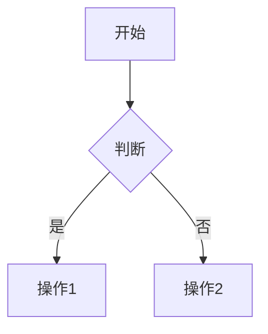

# AI 需求交付模板

> 本模板由产品经理填写，作为 AI 开发的**单一事实源**。AI 在状态 = `已冻结` 时方可开始开发。
>
> - 标记 `<!-- required -->` 的章节必须填写；`<!-- optional -->` 的可按需省略。
> - 所有 ID 全文唯一，遵循附录 A 命名规范。
> - 模板版本：v1.0

---

# [原型名称] 需求交付单

## 0. 元信息 <!-- required -->

| 项 | 内容 |
|---|---|
| 需求编号 | REQ-YYYY-NNN |
| 版本 | v1.0.0 |
| 作者 / 日期 |  |
| **状态** | 草稿 / 评审中 / **已冻结** ← AI 仅在"已冻结"时开发 |
| 关联文档 | 父需求、竞品、Figma（可选） |

---

## 1. 需求背景与目标 <!-- required -->

- **业务问题**（一句话）：
- **目标用户**（角色 + 场景）：
- **成功指标**（可量化）：
- **非目标 / 不做**：

---

## 2. 角色与权限 <!-- required -->

### 2.1 功能权限（看得见 / 点得动）

| 角色 Code | 角色名 | 可见模块 | 可见菜单/按钮 | 可执行操作（增/删/改/查/导出/审批…） |
|---|---|---|---|---|
|  |  |  |  |  |

### 2.2 数据权限（看得到哪些数据） <!-- required -->

> 数据权限独立于功能权限。即便有"查看"按钮，也需在此明确"能看到哪些行、哪些字段"。

#### 2.2.1 行级数据范围

| 角色 Code | 数据范围类型 | 过滤规则 | 示例 |
|---|---|---|---|
| ROLE-ADMIN | 全部 | 无过滤 | 看到全公司订单 |
| ROLE-MANAGER | 本部门及子部门 | `dept_id IN (本人部门及下级)` | 销售经理看到本部门订单 |
| ROLE-USER | 仅本人 | `creator_id = 当前用户` | 业务员仅看自己创建的订单 |
| ROLE-CUSTOM | 自定义 | 描述规则（如：按客户归属/区域/项目组） |  |

> 数据范围类型枚举：`全部 / 本部门 / 本部门及子部门 / 仅本人 / 自定义`。

#### 2.2.2 字段级权限（脱敏 / 隐藏）<!-- optional -->

| 字段 Code | 角色 Code | 处理方式 | 示例 |
|---|---|---|---|
| f_phone | ROLE-USER | 脱敏 | `138****1234` |
| f_salary | 非 HR 角色 | 隐藏 | 列表/详情均不返回 |
| f_id_card | 全部非授权 | 脱敏 | `110***********1234` |

> 处理方式枚举：`明文 / 脱敏 / 隐藏 / 只读`。

#### 2.2.3 操作权限边界

| 操作 | 角色 Code | 数据条件 | 说明 |
|---|---|---|---|
| 编辑 | ROLE-USER | `creator_id = 当前用户 AND status = 草稿` | 仅可编辑自己且未提交的单据 |
| 删除 | ROLE-MANAGER | `dept_id IN (本人部门)` 且 `status != 已审核` | 已审核数据需走作废流程 |
| 审批 | ROLE-MANAGER | 金额 ≤ 角色审批限额 | 超限走更高层级 |

#### 2.2.4 数据共享 / 越权规则 <!-- optional -->

- **显式授权**：数据所有者可主动分享给其他用户/角色（描述场景）
- **代理场景**：上级代下级操作时的数据可见性
- **越权告警**：检测到越权访问时的处理（拒绝 / 记录日志 / 通知）

---

## 3. 业务流程 <!-- required -->

> 用 Mermaid 描述主流程 + 异常分支，禁止用截图。



**异常分支**：超时 / 校验失败 / 并发冲突 → 各自处理策略

---

## 4. 功能清单 <!-- required -->

| ID | 功能名称 | 优先级 | 依赖功能 | 关联角色 | 关联规则 | 验收用例 |
|---|---|---|---|---|---|---|
| F-001 |  | P0 | - |  | R-001 | UC-001 |

> 后续章节均以 **F-xxx** 引用。

---

## 5. 页面结构与 UI 规格 <!-- required -->

### 5.1 信息架构

```
导航
├─ 模块A
│  ├─ P-001 列表页
│  └─ P-002 详情页
└─ 模块B
```

### 5.2 页面：P-001 [页面名] <!-- required -->

- **路径**：`/module/list`
- **入口**：从 X 跳转 / 菜单
- **布局描述**（任选其一或组合，**推荐方式 A**）：

#### 方式 A · 组件清单（推荐）

| 区域 | 组件 | 组件来源 | 说明 |
|---|---|---|---|
| 顶部 | 搜索表单 | 通用 Form | 字段见 §8 |
| 主体 | 数据表格 | 通用 Table | 列见 §8 |
| 操作 | 抽屉 | 通用 Drawer | 触发：点击"新增" |

> 组件来源不限于 Vben，允许自定义/三方组件，但需在此列明。

#### 方式 B · ASCII 线框（可选）

```
┌──搜索区────────────────┐
│ [关键词] [状态▾]  [搜索]│
├──表格区────────────────┤
│ ID │ 名称 │ 状态 │ 操作 │
└────────────────────────┘
```

#### 方式 C · Figma 链接（不推荐，仅作补充）

- 链接：

---

- **字段表 / 列表列**：引用 §8 数据字典
- **状态**：加载态 / 空态 / 错误态描述
- **关联功能**：F-001、F-002

> 每个页面复制 §5.2 一节。

### 5.3 菜单与路由配置 <!-- optional -->

> 仅当本次需求涉及**新增菜单 / 调整菜单结构 / 新增路由**时填写。纯页面改造可省略。

#### 5.3.1 菜单项

| 菜单 ID | 菜单名 | 父菜单 ID | 图标 | 排序 | 权限标识(perm code) | 是否显示 | 关联页面 |
|---|---|---|---|---|---|---|---|
| M-001 | 订单管理 | - | `material-symbols:list-alt` | 10 | `order:menu` | 是 | - |
| M-002 | 订单列表 | M-001 | - | 11 | `order:list` | 是 | P-001 |
| M-003 | 订单详情 | M-001 | - | 12 | `order:detail` | 否 | P-002 |

> 图标命名沿用项目图标库（如 `iconify` 集合名）；权限标识需与后端权限码一致。

#### 5.3.2 路由配置

| 路由 ID | path | 组件路径 | 父路由 | 缓存(keep-alive) | 类型 | 元信息 meta |
|---|---|---|---|---|---|---|
| RT-001 | `/order` | - | - | - | 目录 | `{ title: '订单管理' }` |
| RT-002 | `/order/list` | `views/order/list.vue` | RT-001 | 是 | 页面 | `{ title: '订单列表', perm: 'order:list' }` |
| RT-003 | `/order/detail/:id` | `views/order/detail.vue` | RT-001 | 否 | 页面（隐藏） | `{ title: '订单详情', activeMenu: '/order/list' }` |

- **类型**枚举：`目录 / 页面 / 页面（隐藏）/ 外链 / 内嵌 iframe`
- **隐藏页面**：不在菜单中显示，但需指定 `activeMenu` 高亮的父菜单
- **外链 / iframe**：在 meta 中给出目标 URL 与是否新窗口

#### 5.3.3 菜单/路由变更说明 <!-- optional -->

| 变更类型 | 说明 |
|---|---|
| 新增 | 列出新增的 M-xxx / RT-xxx |
| 修改 | 原值 → 新值（如菜单名调整、排序变动） |
| 删除 | 列出待下线的菜单/路由及替代方案 |

---

## 6. 交互与状态 <!-- required -->

| 交互 ID | 触发 | 行为 | 反馈 | 关联功能 |
|---|---|---|---|---|
| I-001 | 点击保存 | 表单校验 → 提交 → 关闭抽屉 → 刷新表格 | Toast 成功/失败 | F-001 |

补充说明：

- 防重复提交策略
- 二次确认弹窗时机
- 跨页参数传递规则

---

## 7. 业务规则 <!-- required -->

| ID | 规则 | 示例 | 反例 | 优先级 |
|---|---|---|---|---|
| R-001 | 金额 ≤ 0 时不允许提交 | 100 ✓ | 0 ✗ | 高 |

- 计算公式：

  ```
  最终价 = 单价 × 数量 × (1 - 折扣率)
  ```

- 规则冲突时的裁决顺序：R-001 > R-002 > ...

---

## 8. 数据字典 <!-- required -->

### 8.1 字段定义

| 字段 Code | 中文名 | 类型 | 必填 | 长度/范围 | 校验 | 字典引用 | 说明 |
|---|---|---|---|---|---|---|---|
| f_status | 状态 | string | 是 | - | 枚举 | DICT-001 |  |
| f_name | 名称 | string | 是 | 1-50 | 非空 | - |  |

### 8.2 字典定义

> **新字典 → 8.2.A 完整设计**；**复用字典 → 8.2.B 仅写编号 + 名称即可。**

#### 8.2.A 新建字典（需详细设计） <!-- optional -->

| 字典编号 | 字典名 | Key | Value | 中文 | 颜色/Tag | 排序 | 备注 |
|---|---|---|---|---|---|---|---|
| DICT-001 | 订单状态 | order_status | 1 | 待支付 | warning | 1 |  |
| DICT-001 | 订单状态 | order_status | 2 | 已支付 | success | 2 |  |

#### 8.2.B 引用已有字典 <!-- optional -->

| 字典编号 | 字典名 | 用于字段 | 备注 |
|---|---|---|---|
| DICT-SYS-USER-TYPE | 用户类型 | f_user_type | 沿用系统已有 |

> ⚠️ AI 自检：若引用字典在系统不存在 → 阻断开发并告警 PM。

---

## 9. 接口契约 <!-- optional -->

- **复用接口**：列出接口编号 / 路径 / 方法
- **新增接口**：建议给出 Mock JSON 或 OpenAPI 片段，AI 据此生成前端调用并产出后端契约草案

```json
// 示例：POST /api/order/create
{
  "request": { "amount": 100, "userId": "u_001" },
  "response": { "code": 0, "data": { "orderId": "o_001" } }
}
```

---

## 10. 边界与限制 <!-- required -->

| 维度 | 约束 |
|---|---|
| 性能 | 列表 ≤ N 条 / 响应 ≤ N s |
| 兼容 | 浏览器、最小分辨率 |
| 安全 | 脱敏字段、操作日志、权限隔离 |
| **不做清单** | 显式列出本次不实现的相邻功能（防 AI 过度设计，对齐 YAGNI） |

---

## 11. 验收用例 <!-- required -->

| 用例 ID | 关联功能 | 前置 | 操作步骤 | 预期结果 |
|---|---|---|---|---|
| UC-001 | F-001 | 已登录管理员 | 1) 打开列表 2) 点新增 3) 填写并保存 | 列表新增一条，状态=待审核 |

> 推荐用 Given-When-Then 表达复杂用例。

---

## 12. 附录 <!-- optional -->

### 附录 A · ID 命名规范

| 类型 | 前缀 | 示例 |
|---|---|---|
| 需求 | REQ- | REQ-2026-001 |
| 功能 | F- | F-001 |
| 规则 | R- | R-001 |
| 页面 | P- | P-001 |
| 交互 | I- | I-001 |
| 字段 | f_ | f_status |
| 字典 | DICT- | DICT-001 |
| 用例 | UC- | UC-001 |
| 菜单 | M- | M-001 |
| 路由 | RT- | RT-001 |

### 附录 B · AI 自检清单（开发前强制执行）

```yaml
preflight_checks:
  - 状态字段 == "已冻结"            # 否则拒绝开发
  - 所有 <!-- required --> 段非空
  - 功能 ID / 规则 ID / 字段 Code 全文唯一且无悬挂引用
  - 引用字典(8.2.B) 在系统中存在
  - 每个 P0 功能至少 1 条验收用例
  - 每个页面至少 1 个 UI 描述方式
  - 每个角色在 §2.2.1 行级数据范围中均有定义     # 数据权限不可省
  - 涉及敏感字段(手机/身份证/薪资等)时 §2.2.2 已声明脱敏策略
缺项处理: 输出缺项清单 → 阻断开发 → 退回 PM
```

### 附录 C · 冻结与变更流程

```
草稿 → 评审中 → 已冻结 → AI 开发
                ↑          ↓
                └── 变更走变更记录，版本号 +1
```

### 附录 D · 变更记录

| 版本 | 日期 | 变更内容 | 作者 |
|---|---|---|---|
| v1.0.0 |  | 初始版本 |  |

### 附录 E · 术语表 / FAQ

-
