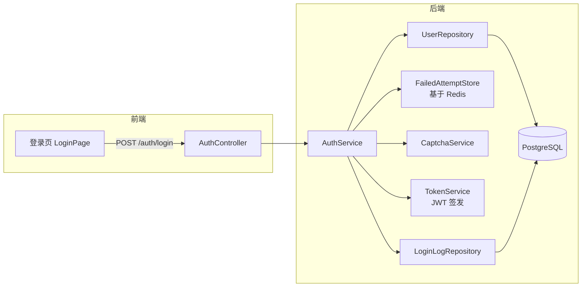

# 用户登录功能实施方案（已填写样例）

> 这是一份**已填写**的实施方案样例，与 `_示例_需求分析_用户登录.md` 配对。
> 复制时**删除本说明行**与文档名中的 `_示例_` 前缀。

---

## 元信息

- **功能名称**：用户登录功能
- **关联需求**：`docs/01_需求分析/20260510_用户登录需求分析.md`（v1.0 已冻结）
- **类型**：新功能（替换老版本）
- **预估工作量**：后端 2 天，前端 2 天，联调 + 测试 1 天
- **版本**：v1.0
- **状态**：已确认
- **创建日期**：2026-05-12
- **作者**：AI（开发者 2026-05-13 确认）

---

## 1. 方案概述

提供一套基于 用户名/邮箱 + 密码 + 图形验证码 + 失败锁定 的登录方案。后端基于 Redis 维护失败计数与锁定状态，前端在 3 次失败后展示验证码。Token 用 JWT，access/refresh 双 token 分离。

---

## 2. 整体架构



---

## 3. 数据库设计

### 3.1 修改已有表 `user`

```sql
ALTER TABLE user ADD COLUMN failed_attempts INT NOT NULL DEFAULT 0;
ALTER TABLE user ADD COLUMN locked_until TIMESTAMP NULL;
-- 状态字段 status 已存在，确认包含 LOCKED 枚举值
```

> 注：`failed_attempts` 与 `locked_until` 也可只放 Redis（更高性能），DB 字段作为兜底持久化。本方案采取"双写"——简化降级路径。

### 3.2 新增表 `login_log`

```sql
CREATE TABLE login_log (
  id BIGINT PRIMARY KEY,
  user_id BIGINT NULL,                -- 失败时可能查不到用户
  username_input VARCHAR(128),        -- 实际输入（脱敏后）
  ip VARCHAR(64),
  user_agent VARCHAR(512),
  result VARCHAR(32) NOT NULL,        -- SUCCESS / WRONG_PASSWORD / LOCKED / DISABLED / CAPTCHA_FAILED
  error_code VARCHAR(64),
  created_at TIMESTAMP NOT NULL DEFAULT CURRENT_TIMESTAMP
);

CREATE INDEX idx_login_log_user_id_created_at ON login_log(user_id, created_at);
CREATE INDEX idx_login_log_created_at ON login_log(created_at);
```

### 3.3 迁移脚本

- `V20260513001__alter_user_add_failed_attempts.sql`
- `V20260513002__create_login_log.sql`

### 3.4 回滚策略

- ALTER：可回滚（DROP COLUMN），但需确认 30 天内不会大规模回退
- CREATE TABLE：可直接 DROP

---

## 4. 接口设计

### 4.1 `POST /api/v1/auth/login`

- **权限**：免登录（白名单）
- **入参**：
  ```json
  {
    "principal": "string, required, 3-128, 用户名或邮箱",
    "password": "string, required, 6-64",
    "captcha": "string, optional",
    "captchaToken": "string, optional",
    "rememberMe": "boolean, optional, default false"
  }
  ```
- **出参 200**：
  ```json
  {
    "accessToken": "...",
    "refreshToken": "...",
    "expiresIn": 1800,
    "user": { "id": "...", "username": "...", "email": "..." }
  }
  ```
- **错误码**：
  - `400 COMMON_INVALID_PARAM`
  - `401 USER_PASSWORD_WRONG`（统一文案"用户名或密码错误"，覆盖用户不存在 / 密码错误 / 用户被禁用）
  - `401 USER_LOCKED`（响应体含 `lockedUntil` 字段）
  - `400 CAPTCHA_REQUIRED`（需要验证码但未提供）
  - `400 CAPTCHA_INVALID`（验证码错误）
  - `429 COMMON_TOO_MANY_REQUESTS`（IP 限流）
- **幂等**：无需

### 4.2 `GET /api/v1/auth/captcha`

- **权限**：免登录
- **出参**：`{ token: "xxx", imageBase64: "data:image/png;base64,..." }`
- **5 分钟有效，单次使用**

### 4.3 `POST /api/v1/auth/refresh`

- 入参：`{ refreshToken }`
- 出参：新的 access/refresh token

### 4.4 `POST /api/v1/users/{id}/unlock` （管理员）

- **权限**：`user:unlock`
- **行为**：清空 `failed_attempts`、`locked_until`、status 改为 ACTIVE
- **审计日志**：记录解锁人 + 被解锁人 + 时间

---

## 5. 后端实现

### 5.1 涉及模块
- `auth` 模块（新增）：Controller / Service / TokenService / CaptchaService
- `user` 模块：UserRepository 加方法 `findByUsernameOrEmail`
- `audit` 模块：复用已有的审计日志写入

### 5.2 关键类与方法

```
AuthController.login(LoginRequest) → LoginResponse
AuthService.login(LoginCommand) → AuthResult
  - 检查失败计数：≥3 需 captcha；≥5 锁定
  - 查 user
  - 验 password (BCrypt)
  - 失败：+1 计数；记 LoginLog
  - 成功：发 token；清计数；记 LoginLog
TokenService.issue(user, rememberMe) → (access, refresh)
CaptchaService.generate() / verify(token, input)
UserService.unlock(userId, operatorId) → void  [管理员]
```

### 5.3 关键业务规则

- 失败计数 key：`login:fail:{username}`，TTL 24h
- 锁定 key：`login:locked:{username}`，TTL = 15min
- **失败计数与锁定走 username**，不走 user_id（用户不存在时也要计）
- DB 字段 `failed_attempts` / `locked_until` 在登录成功时清零（兜底持久化）
- 密码用 BCrypt（cost=12）

### 5.4 事务与并发

- 登录流程**不开 DB 事务**（只有读 + 写 LoginLog，不需要事务）
- 失败计数靠 Redis `INCR` 原子操作
- 解锁接口在事务中：更新 user 表 + 写审计日志

### 5.5 外部依赖

- Redis：失败计数 / 锁定 / 验证码 token
- 验证码：使用项目已有的 `captcha-lib` v3.1（已确认本版本支持）

---

## 6. 前端实现

### 6.1 页面结构
- `/login` 登录页（替换旧版）
- `/admin/users` 列表行操作"解锁"（仅 LOCKED 状态显示）

### 6.2 组件 / 状态
- 新增 `LoginPage.vue`（替换旧 `Login.vue`）
- 新增 `CaptchaInput.vue` 复用组件
- 状态：本地 state（不入 store——登录前无用户态）

### 6.3 关键交互
- 失败 ≥ 3 次自动拉验证码（基于响应错误码 `CAPTCHA_REQUIRED`）
- LOCKED 状态展示剩余分钟数 + 联系管理员链接
- "记住我"勾选 → 请求带 `rememberMe: true`
- 登录成功 → 写 token 到 HttpOnly Cookie（不写 localStorage）
- 跳转：登录前来源页（query `redirect=`）或首页

### 6.4 四态
- 加载态：登录按钮 spinner + disabled
- 错误态：字段下方提示 / 顶部 toast
- （空态 / 权限态对登录页不适用）

---

## 7. 兼容性与影响分析

### 7.1 兼容性
- 数据兼容：现有 user 表数据 `failed_attempts` 默认 0，`locked_until` 为 NULL，老用户首次登录正常
- 接口兼容：登录接口路径变化（旧 `/login` → 新 `/api/v1/auth/login`），**前端同步替换**；后端老路径保留 30 天返回 410 Gone + 跳转提示
- 前端兼容：旧 Login.vue 删除；引用该组件的其他代码已 grep 确认无

### 7.2 调用方清单
- 前端 `router/index.ts:42` 配置登录路由
- 前端 `api/auth.ts:15` 登录接口调用
- 后端 `SecurityConfig.java:67` 配置免登录路径
- 共发现 3 处需要修改，均在本 PR 内处理

### 7.3 回归风险
- 风险 1：老 user 表的 `status` 字段历史值是否都在新的枚举集内？
  - 缓解：迁移前 SELECT DISTINCT 校验
- 风险 2：BCrypt cost 调整为 12 是否会让登录变慢？
  - 缓解：性能测试，预期 ~100ms 增加，仍 < 500ms 目标

### 7.4 回滚方案
- 数据库：DROP 新加字段与新表
- 代码：revert 本 PR
- 老登录页：保留 30 天可回切

---

## 8. 安全设计

- 密码：BCrypt（cost=12），**禁止其他算法**
- Token：JWT，HS256，access 30min / refresh 30d 或 24h（rememberMe）
- 存放：HttpOnly + Secure + SameSite=Strict Cookie
- 限流：单 IP 10 次/分钟，单 username 20 次/分钟
- 错误提示统一：不暴露用户存在性
- 日志：**禁止**记录明文密码与 token
- 详见 `docs/00_通用规范/06_安全规范.md`

---

## 9. 可观测性

- 关键日志：
  - INFO：login success username={脱敏} user_id=
  - WARN：login failed (with reason)
  - WARN：account locked username={脱敏}
  - ERROR：unexpected exception in login flow
- 监控指标：
  - 登录成功率 / 失败率（按错误码）
  - P95 登录耗时
  - 锁定事件计数（每小时）
- 审计：所有解锁操作

---

## 10. 风险与降级

| 风险 | 影响 | 应对 |
|---|---|---|
| Redis 宕机 | 失败计数 / 锁定失效 | 降级：跳过计数与锁定（feature flag），打 WARN，DB 兜底字段最低限度生效 |
| 验证码服务慢 | 登录耗时拉长 | 超时 1s 降级跳过，打 WARN |
| BCrypt 太慢 | 接口耗时不达标 | 性能测试，必要时把 cost 降到 10 |

---

## 11. 测试用例

| 编号 | 关联 | 前置 | 步骤 | 预期 | 优先级 |
|---|---|---|---|---|---|
| TC-AUTH-001 | F-01 | 用户已注册 | 正确凭证登录 | 200 + tokens | P0 |
| TC-AUTH-002 | F-01 | 同上 | 错误密码 | 401 USER_PASSWORD_WRONG | P0 |
| TC-AUTH-003 | F-01 | 不存在用户名 | 任意密码 | 401 USER_PASSWORD_WRONG（**与上一条响应一致**） | P0 |
| TC-AUTH-004 | F-02 | 已失败 3 次 | 不带 captcha 登录 | 400 CAPTCHA_REQUIRED | P0 |
| TC-AUTH-005 | F-02 | 已失败 3 次 | 错误 captcha | 400 CAPTCHA_INVALID | P1 |
| TC-AUTH-006 | F-03 | 已失败 4 次 | 第 5 次错误 | 401 USER_LOCKED 含 lockedUntil | P0 |
| TC-AUTH-007 | F-03 | 锁定中 | 任意凭证 | 401 USER_LOCKED | P0 |
| TC-AUTH-008 | F-03 | 锁定 15 分钟后 | 正确凭证 | 200 + tokens | P0 |
| TC-AUTH-009 | F-04 | rememberMe=true | 登录 | refreshToken 30 天有效 | P1 |
| TC-AUTH-010 | F-04 | rememberMe=false | 登录 | refreshToken 24h | P1 |
| TC-AUTH-011 | F-05 | 任意 | 登录（成功/失败） | login_log 有记录 | P1 |
| TC-AUTH-012 | F-06 | 用户已锁定 | 管理员解锁 | failed=0, locked_until=NULL, status=ACTIVE | P0 |
| TC-AUTH-013 | F-06 | 普通用户 | 调用解锁接口 | 403 | P0（越权） |
| TC-AUTH-014 | 性能 | - | 100 次并发登录 | P95 < 500ms | P1 |
| TC-AUTH-015 | 安全 | - | 暴力破解 100 次/min | 第 5 次后 LOCKED，无 SUCCESS | P0 |

---

## 12. 实施计划

| 步骤 | 内容 | 预计 | 依赖 |
|---|---|---|---|
| 1 | DB 迁移脚本 + 字典更新 | 0.5d | - |
| 2 | 后端 AuthService / Controller / Token | 1d | 1 |
| 3 | 后端 LoginLog / 解锁接口 | 0.5d | 1 |
| 4 | 前端登录页 + CaptchaInput | 1.5d | 2 |
| 5 | 前端用户管理"解锁" | 0.5d | 3 |
| 6 | 联调 + 自测 | 0.5d | 4,5 |
| 7 | 测试 + 审查 | 0.5d | 6 |

---

## 13. 待确认事项

已全部确认（见需求文档 §13）。

---

## 14. 评审记录

| 日期 | 评审人 | 意见 | 处理结果 |
|---|---|---|---|
| 2026-05-12 | 开发者 | DB 兜底字段是否必要？是否仅 Redis 即可？ | 保留 DB 字段做降级兜底 |
| 2026-05-13 | 开发者 | BCrypt cost 12 vs 10？ | 先用 12，性能不达标再降 |
| 2026-05-13 | 开发者 | 整体方案**已确认开始实施** | - |

---

## 15. 实施结果（开发完成后回填）

- 实际工作量：5.5 天（比预估 5d 多 0.5d，主要花在 BCrypt 性能调优）
- before/after：旧登录 ~400ms / 新登录 P95 ~310ms ✓
- 测试结论：15 条全部通过
- 回归结论：已注册用户登录、找回密码（另一功能不涉及）跑通
