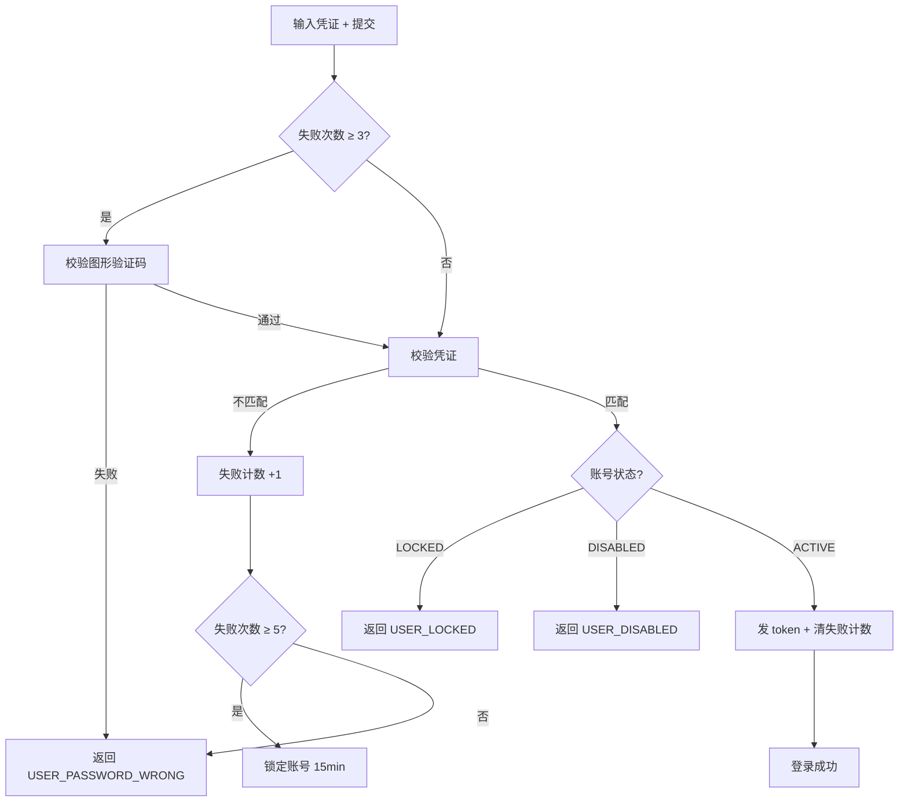
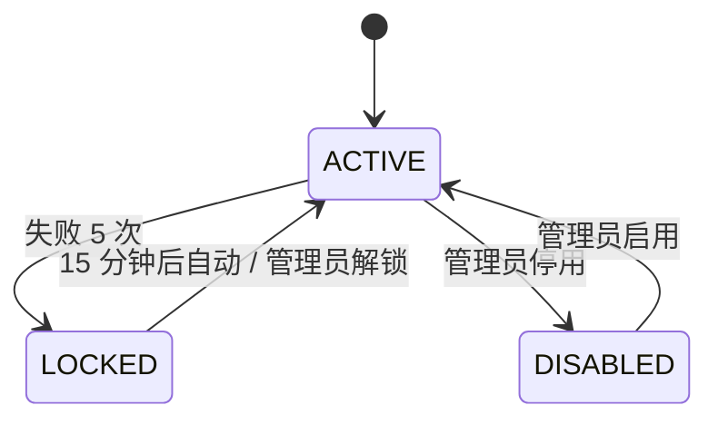

# 用户登录功能需求分析（已填写样例）

> 这是一份**已填写**的需求分析文档样例，展示 `需求分析模板.md` 实际怎么用。
> 复制时**删除本说明行**与文档名中的 `_示例_` 前缀。

---

## 元信息

- **需求名称**：用户登录功能
- **需求来源**：产品经理 张三
- **关联 PRD / UI**：`docs/UI-PRD/用户登录_v1.2.fig`
- **优先级**：P0
- **状态**：已冻结
- **版本**：v1.0
- **创建日期**：2026-05-01
- **最后更新**：2026-05-10

---

## 1. 业务背景

系统目前所有功能均需登录使用。当前登录页是早期临时版本，存在三个问题：
- 无验证码与锁定机制，遭受暴力破解攻击 12 次/月（运维报告）
- 错误提示泄露用户名是否存在（"用户不存在" vs "密码错误"）
- 无"记住我"功能，用户每天反复登录体验差

**不做的话**：暴力破解风险持续；老用户已多次投诉日常登录烦琐。
**做了之后**：登录页符合 OWASP 最佳实践；日活用户预期减少 70% 重复登录；攻击量预期降为接近 0。

---

## 2. 目标与非目标

### 目标
- 用户能用 用户名/邮箱 + 密码 登录
- 连续登录失败 N 次触发图形验证码
- 连续登录失败 M 次锁定 X 分钟
- 支持"记住我"延长登录态
- 不区分"用户不存在"与"密码错误"
- 登录耗时 P95 < 500ms

### 非目标（本次不做）
- 短信 / 邮箱验证码登录
- 第三方 OAuth（微信、Google）
- 多因素认证（MFA）
- 单点登录（SSO）
- 找回密码（另行评估）

---

## 3. 用户与场景

### 用户角色
| 角色 | 描述 | 权限 |
|---|---|---|
| 注册用户 | 已注册的普通用户 | 可登录 |
| 管理员 | 后台管理员 | 可登录 + 可解锁其他账号 |
| 未注册 | 未注册访客 | 不可登录，引导注册（另一个需求） |

### 核心使用场景
1. **正常登录**
   - 触发：用户在登录页输入正确凭证 → 点登录
   - 流程：校验通过 → 生成 access/refresh token → 跳转到此前访问的页面（默认首页）
   - 结果：进入应用主界面
2. **密码错误**
   - 触发：用户输入错误密码 → 点登录
   - 流程：失败计数 +1 → 返回统一提示 → 失败计数 ≥ 3 时下次需验证码 → 失败计数 ≥ 5 时锁定 15 分钟
3. **账号锁定**
   - 触发：失败 5 次后再次尝试
   - 流程：返回"账号已锁定，请 X 分钟后重试或联系管理员"
4. **管理员解锁**
   - 触发：管理员在后台手动解锁
   - 流程：清空失败计数、解除锁定状态

---

## 4. 业务流程

---

## 5. 数据模型

| 实体 | 关键属性 | 关系 |
|---|---|---|
| User | id, username, email, passwordHash, status, failedAttempts, lockedUntil | - |
| LoginLog | id, userId, ip, userAgent, result, errorCode, createdAt | 多对一 User |

状态机：

---

## 6. 功能清单

| 编号 | 功能 | 必做 / 可选 | 备注 |
|---|---|---|---|
| F-01 | 用户名/邮箱 + 密码登录 | 必做 | |
| F-02 | 图形验证码（失败 ≥ 3 次触发） | 必做 | |
| F-03 | 账号锁定（失败 ≥ 5 次） | 必做 | |
| F-04 | "记住我"延长登录态 | 必做 | refresh token 30 天 |
| F-05 | 登录日志记录 | 必做 | |
| F-06 | 管理员解锁 | 必做 | 后台用户管理 |

---

## 7. 业务规则

### 7.1 校验规则
- username：必填、3-32 字符、字母数字下划线
- email：可选（与 username 二选一）、邮箱格式
- password：必填、6-64 字符
- captcha：失败计数 ≥ 3 时必填

### 7.2 计算规则
- 失败计数：每次失败 +1
- 锁定时长：15 分钟（配置化）
- 自动解锁时间：`lockedUntil = now() + 15min`，到期视为 ACTIVE
- 登录成功后 `failedAttempts` 清零

### 7.3 权限规则
- 解锁账号：仅 `user:unlock` 权限角色

### 7.4 错误提示规则（重要）
- **登录失败一律返回 `USER_PASSWORD_WRONG: "用户名或密码错误"`**
- 不暴露 "用户不存在 / 用户已禁用 / 密码错误" 的区分
- 例外：账号 LOCKED 状态可返回 `USER_LOCKED`（用户已知自己账号存在）

---

## 8. 验收标准

- [ ] 正确凭证登录成功，返回 access + refresh token，跳转到目标页
- [ ] 错误密码 1 次：返回统一提示，无验证码挑战
- [ ] 错误密码 3 次：下一次登录页显示验证码
- [ ] 错误密码 5 次：账号锁定，再尝试返回 `USER_LOCKED`
- [ ] 锁定 15 分钟后再次尝试：自动解锁，正常验证
- [ ] 用户不存在 + 错误密码：返回与"密码错误"完全相同的响应
- [ ] 勾选"记住我"：refresh token 有效期 30 天；不勾：仅 access token（30 分钟）
- [ ] 登录成功 / 失败均产生 LoginLog 记录
- [ ] 管理员能在用户管理后台解锁账号
- [ ] 登录接口 P95 < 500ms（不含 captcha 校验）
- [ ] 模拟暴力破解（自动化 100 次/分钟）：第 5 次后被锁定，后续全部返回 LOCKED

---

## 9. 边界条件 / 异常路径

| 场景 | 行为 |
|---|---|
| 网络超时 | 提示"网络异常，请稍后重试"，按钮恢复可点 |
| 验证码服务挂 | 降级：跳过验证码（开关），打 WARN 日志 |
| Redis（存计数）挂 | 降级：跳过计数与锁定，打 WARN，登录功能不阻塞 |
| 并发 5 次失败 | 任一一条触发锁定即生效（不要求严格"第 5 次"） |
| 锁定期间又锁定 | `lockedUntil` 不延长（避免无限拉长） |
| token 校验失败 | 401，前端跳登录页 |

---

## 10. 关联影响

### 受影响的现有功能
- 旧登录页：直接替换
- 所有受保护接口：token 校验逻辑保持不变

### 依赖的现有功能
- 用户中心（已存在 User 表，本次需加 `failedAttempts`、`lockedUntil` 字段）
- 字典服务：新增 `USER_STATUS.LOCKED`

### 配置变更
- 字典新增 `USER_STATUS.LOCKED` → 同步 `docs/11_字典/系统字典.md`
- 错误码新增 `USER_LOCKED`、`USER_PASSWORD_WRONG`（其实已存在）→ 同步 `docs/11_字典/错误码字典.md`
- 新增菜单"用户管理" → 用户手册中说明
- 新增权限点 `user:unlock` → 用户手册中说明

---

## 11. UI / 交互

参考 `docs/UI-PRD/用户登录_v1.2.fig`：
- 登录页：用户名/邮箱、密码、记住我、验证码（条件显示）、登录按钮
- 锁定弹窗：显示剩余分钟数 + 联系管理员链接
- 后台用户管理 → 行操作"解锁"按钮（仅锁定状态显示）

---

## 12. 测试视角评审记录

可测性体检：
- [x] 验收用例可直接转为测试步骤
- [x] 边界条件明确（失败 1/2/3/4/5/6 次的行为均明确）
- [x] 异常路径覆盖（网络、Redis 挂、并发）
- [x] 可观测性就绪（LoginLog + 接口日志）
- [x] 可回放性具备（种子用户 + 失败计数可手工重置）

无阻塞问题。

---

## 13. 待确认事项（已与产品确认）

- ~~锁定时长是 10 / 15 / 30 分钟？~~ → 15 分钟（产品 2026-05-08 确认）
- ~~"记住我" 30 天 / 7 天？~~ → 30 天，但敏感操作需重新输密码（另一个需求）
- ~~验证码触发阈值是 3 还是 5？~~ → 3 次显示验证码，5 次锁定

---

## 14. 变更记录

| 日期 | 版本 | 变更内容 | 操作人 |
|---|---|---|---|
| 2026-05-01 | v0.1 | 初稿 | AI |
| 2026-05-08 | v0.2 | 补充验证码 / 锁定阈值，产品确认 | AI |
| 2026-05-10 | v1.0 | 冻结 | 产品 |
